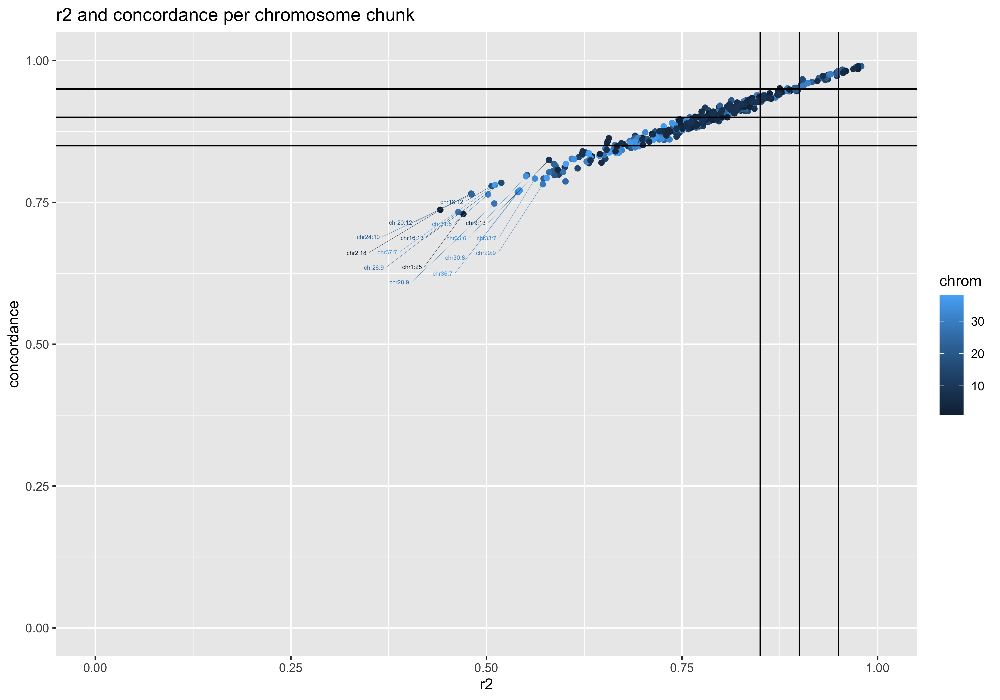
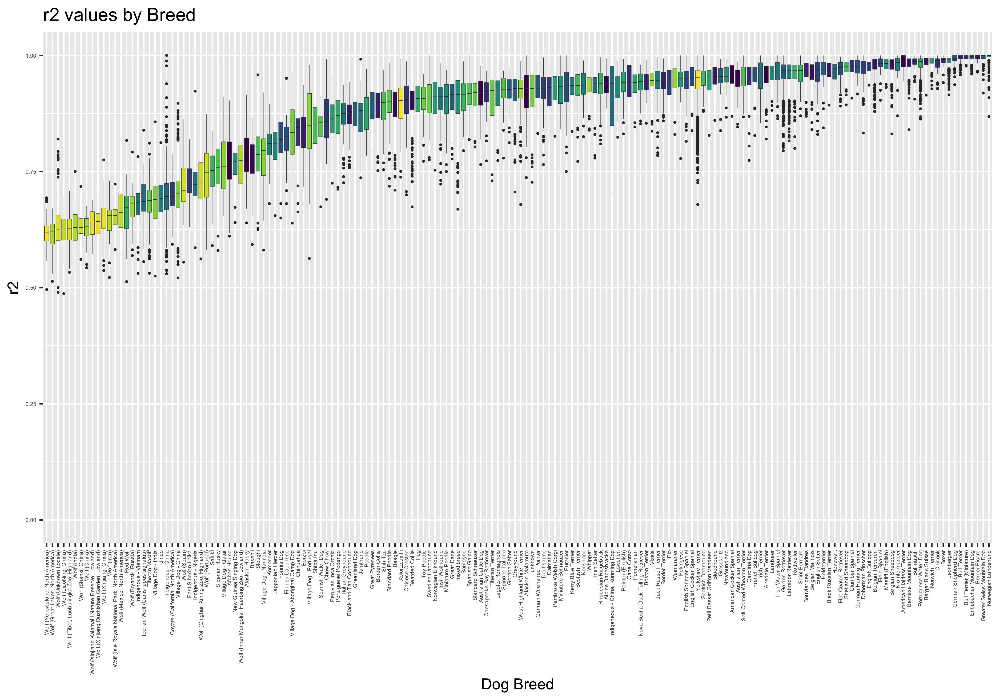

Imputation Data Analysis
================
Anton Enright (<aje39@cam.ac.uk>)
17 June, 2025

- [Imputation Analysis](#imputation-analysis)
- [Load Libraries](#load-libraries)
- [Global analysis of imputation
  metrics](#global-analysis-of-imputation-metrics)
- [Imputation Accuract by Individual or
  Breed](#imputation-accuract-by-individual-or-breed)

# Imputation Analysis

In this R script we will explore the results generated by *impute2* on
the dataset for Eleanor Raffan and Jade Scardham. We have already
discussed the analysis pipeline in the [README.md](../README.md)
previously. The data generated there is here in the current analysis
folder as: [`all_stats_by_chr.txt`](all_stats_by_chr.txt) and
[`all_stats_by_individual.txt`](all_stats_by_individual.txt).

Before we get started we will load some libraries needed, most
importantly *ggplot2*.

# Load Libraries

``` r
library(gtools)
library(ggplot2)
library(viridisLite)
library(viridis)
```

# Global analysis of imputation metrics

First we explore the imputation accuracy across chromosomes and
chromosome chunks. For each chunk and chromosome we have mutiple metrics
including the $r^2$ metric and the *concordance* values.

We’ll start by plotting boxplots of each chromosomes $r^2$ and
concordance values.

``` r
data <- read.table("all_stats_by_chr.txt",header=FALSE,sep="\t")
colnames(data)=c("chr","pos","maf","info","concordance","r2")
data$chr <- paste0("chr",data$chr)
data <- data[mixedorder(data$chr),]

data$chr <- factor(data$chr,levels = mixedsort(unique(data$chr)),ordered = TRUE)

my_colours <- viridisLite::viridis(length(levels(data$chr)))


p <- ggplot(data, aes(x=chr, y=r2, fill=chr)) + scale_fill_manual(values = my_colours) + geom_boxplot(outlier.size=0.3) + theme(axis.text.x = element_text(angle = 90, vjust = 0.5, hjust=1)) + ggtitle("r2 values per chromsome") + xlab("Chromosome") + geom_hline(yintercept=median(data$r2), linetype="dashed", color = "red") + theme(legend.position="none") + coord_cartesian(ylim = c(0, 1.0))
p
```

<!-- -->

``` r
p <- ggplot(data, aes(x=chr, y=concordance, fill=chr)) + scale_fill_manual(values = my_colours) + geom_boxplot(outlier.size=0.3) + theme(axis.text.x = element_text(angle = 90, vjust = 0.5, hjust=1)) + ggtitle("Concordance values per chromsome") + xlab("Chromosome") + geom_hline(yintercept=median(data$concordance), linetype="dashed", color = "red") + theme(legend.position="none") + coord_cartesian(ylim = c(0, 1.0))
p
```

<!-- -->

``` r
data_chunk <- read.table("all_stats_by_chunk.txt",header=T,sep="\t")

ggplot(data_chunk, aes(x = r2_med, y = con_med, color = chrom)) +
  geom_point()  + coord_cartesian(ylim = c(0, 1.0),xlim = c(0, 1.0)) + ggtitle("r2 and concordance per chromosome chunk") +
  xlab("r2") + ylab("concordance") + geom_hline(yintercept = c(0.85, 0.9, 0.95)) +
  geom_vline(xintercept = c(0.85, 0.9, 0.95)) 
```

<!-- -->

# Imputation Accuract by Individual or Breed

We now.

``` r
data_ind <- read.table("all_stats_by_individual.txt",header=FALSE,sep="\t")
colnames(data_ind)=c("chr","no","i","type","breed","sex","concordance","r2")
data_ind$breed=as.factor(data_ind$breed)
my_colours_breed <- viridisLite::viridis(length(levels(data_ind$breed)))

p <- ggplot(data_ind, aes(reorder(breed, r2, FUN=median), y = r2, fill=breed)) + scale_fill_manual(values = my_colours_breed) + geom_boxplot(outlier.size=0.3) + theme(axis.text.x = element_text(angle = 90, vjust = 0.5, hjust=1)) + theme(legend.text = element_text(size = 2)) + ggtitle("r2 values by Breed") + xlab("Chromosome") + theme(legend.key.size = unit(0.3, 'cm')) + theme(legend.position="none") + theme(axis.text=element_text(size=4)) + coord_cartesian(ylim = c(0, 1.0))
p
```

<!-- -->
