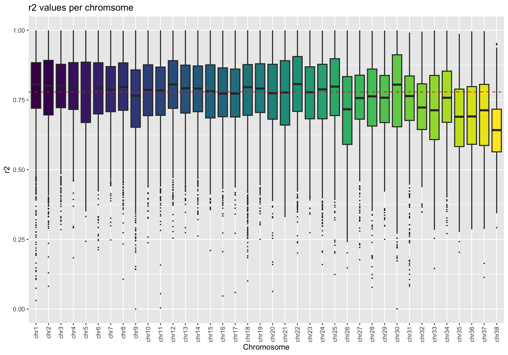
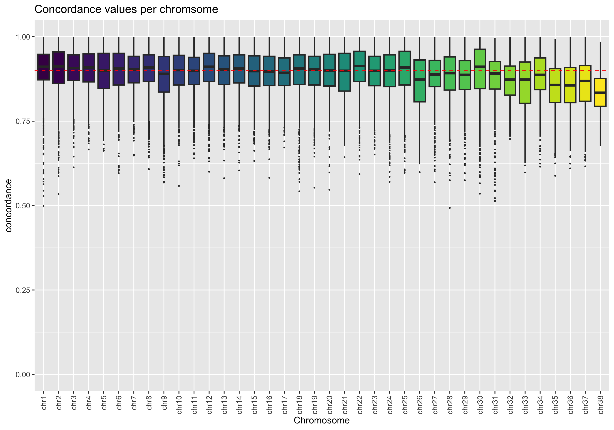
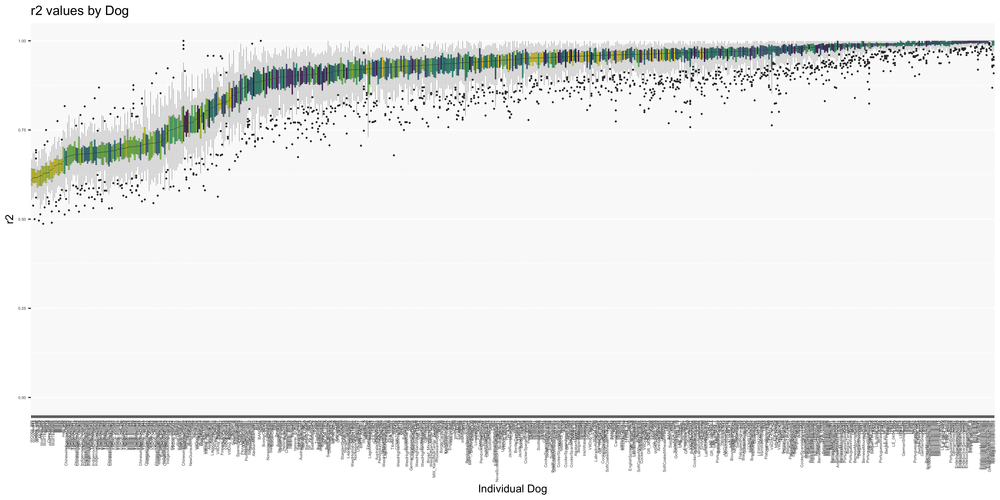

Imputation Data Analysis
================
Anton Enright (<aje39@cam.ac.uk>)
17 June, 2025

- [Imputation Analysis](#imputation-analysis)
- [Load Libraries](#load-libraries)
- [Global analysis of imputation
  metrics](#global-analysis-of-imputation-metrics)
  - [Boxplots of Imputation QC
    values](#boxplots-of-imputation-qc-values)
- [Imputation Accuract by Individual or
  Breed](#imputation-accuract-by-individual-or-breed)
  - [Heatmap of R2 values per chromosome and
    individual](#heatmap-of-r2-values-per-chromosome-and-individual)
  - [MAF analysis](#maf-analysis)

# Imputation Analysis

In this R script we will explore the results generated by *impute2* on
the dataset for Eleanor Raffan and Jade Scardham. We have already
discussed the analysis pipeline in the [README.md](../README.md)
previously. The data generated there is here in the current analysis
folder as: [`all_stats_by_chr.txt`](all_stats_by_chr.txt) and
[`all_stats_by_chunk.txt`](all_stats_by_chunk.txt) and
[`all_stats_by_individual.txt`](all_stats_by_individual.txt).

Before we get started we will load some libraries needed, most
importantly *ggplot2*.

# Load Libraries

``` r
library(gtools)
library(ggplot2)
library(ggrepel)
library(viridisLite)
library(viridis)
library(gplots)
library(tidyr)
```

# Global analysis of imputation metrics

First we explore the imputation accuracy across chromosomes and
chromosome chunks. For each chunk and chromosome we have mutiple metrics
including the $r^2$ metric and the *concordance* values.

## Boxplots of Imputation QC values

We’ll start by plotting boxplots of each chromosomes $r^2$ and
concordance values.

``` r
data <- read.table("all_stats_by_chr.txt",header=FALSE,sep="\t")
colnames(data)=c("chr","pos","maf","info","concordance","r2")
data$chr <- paste0("chr",data$chr)
data <- data[mixedorder(data$chr),]

data$chr <- factor(data$chr,levels = mixedsort(unique(data$chr)),ordered = TRUE)

my_colours <- viridisLite::viridis(length(levels(data$chr)))


p <- ggplot(data, aes(x=chr, y=r2, fill=chr)) + scale_fill_manual(values = my_colours) + geom_boxplot(outlier.size=0.3,lwd=0.7) + theme(axis.text.x = element_text(angle = 90, vjust = 0.5, hjust=1)) + ggtitle("r2 values per chromsome") + xlab("Chromosome") + geom_hline(yintercept=median(data$r2), linetype="dashed", color = "red") + theme(legend.position="none") + coord_cartesian(ylim = c(0, 1.0))
p
```

<!-- -->

``` r
p <- ggplot(data, aes(x=chr, y=concordance, fill=chr)) + scale_fill_manual(values = my_colours) + geom_boxplot(outlier.size=0.3,lwd=0.7) + theme(axis.text.x = element_text(angle = 90, vjust = 0.5, hjust=1)) + ggtitle("Concordance values per chromsome") + xlab("Chromosome") + geom_hline(yintercept=median(data$concordance), linetype="dashed", color = "red") + theme(legend.position="none") + coord_cartesian(ylim = c(0, 1.0))
p
```

<!-- -->
\## Exploration of Chromosome Chunks Here we look to see if there are
any outliers from the 5Mb regions each Chromosome was broken into. In
general things look stable.

``` r
data_chunk <- read.table("all_stats_by_chunk.txt",header=T,sep="\t")

data_chunk$name=paste0("chr",data_chunk$chrom,":",data_chunk$chunk)

ggplot(data_chunk, aes(x = r2_med, y = con_med, color = chrom)) +
  geom_point()  + coord_cartesian(ylim = c(0, 1.0),xlim = c(0, 1.0)) + ggtitle("r2 and concordance per chromosome chunk") +
  xlab("r2") + ylab("concordance") + geom_hline(yintercept = c(0.85, 0.9, 0.95)) +
  geom_vline(xintercept = c(0.85, 0.9, 0.95)) + geom_text_repel(
    data = data_chunk[(data_chunk$r2_med < 0.6),],
    mapping = aes(label = name),
    nudge_x = -0.1, nudge_y = -0.1,
    max.time = 5,
    max.iter = Inf,
    size=1.5, segment.size=0.1, max.overlaps = 10,
    show.legend = F
  )
```

<!-- -->

# Imputation Accuract by Individual or Breed

We now look at individual breeds, it seems some are dragging down the
imputation QC metrics signficantly with many well represented domestic
dogs being \>90 or 95%.

``` r
data_ind <- read.table("all_stats_by_individual.txt",header=FALSE,sep="\t")
colnames(data_ind)=c("chr","no","i","type","breed","sex","concordance","r2")
data_ind$breed=as.factor(data_ind$breed)
my_colours_breed <- viridisLite::viridis(length(levels(data_ind$breed)))

p <- ggplot(data_ind, aes(reorder(breed, r2, decreasing=T, FUN=median), y = r2, fill=breed)) + scale_fill_manual(values = my_colours_breed) + geom_boxplot(outlier.size=0.3,lwd=0.1) + theme(axis.text.x = element_text(angle = 90, vjust = 0.5, hjust=1)) + theme(legend.text = element_text(size = 2)) + ggtitle("r2 values by Breed") + xlab("Chromosome") + theme(legend.key.size = unit(0.3, 'cm')) + theme(legend.position="none") + theme(axis.text=element_text(size=4)) + coord_cartesian(ylim = c(0, 1.0))
p
```

<!-- -->

## Heatmap of R2 values per chromosome and individual

We can further break this down by chromosome and individual to see where
the problems arise.

``` r
d_mat <- matrix(0.00, nrow = 38, ncol = length(unique(data_ind$i)))
dlist <- unique(data_ind$i)

for(i in c(1:38)){
  for (j in c(1:length(dlist))){
    z=data_ind[((data_ind$i==dlist[j]) & (data_ind$chr==i)),"r2"]
    if(!identical(z, numeric(0))){
      d_mat[i,j] <- as.numeric(data_ind[((data_ind$i==dlist[j])& (data_ind$chr==i)),"r2"])
    } else {
      d_mat[i,j] <- 0.0
    }
  }
}
d_mat <- data.frame(d_mat)
colnames(d_mat)<- dlist
rownames(d_mat)<- paste0("chr",1:38)

op <- par(no.readonly = TRUE) 
lmat=rbind( c(0, 3), c(2,1), c(0,4) )
lhei=c(0.5, 6, 1.5)

heatmap.2(as.matrix(d_mat),trace="none",Rowv = FALSE,cexCol = 0.4,cexRow=0.4,col=viridis(15, direction = -1),dendrogram="none",lmat=lmat, lhei=lhei)
```

<!-- -->

## MAF analysis

Finally we can look at MAF versus concordance and r2 values.

``` r
ggplot(data,aes(x=maf,y=concordance,color=info)) + geom_point(alpha = .5, shape = 15) + geom_hline(yintercept = 0.85) + coord_cartesian(ylim = c(0, 1.0),xlim = c(0, 1.0)) + ggtitle("Concordance vs MAF")
```

<!-- -->

``` r
ggplot(data,aes(x=maf,y=concordance,color=info)) + geom_point(alpha = .5, shape = 15) + geom_hline(yintercept = 0.85) + coord_cartesian(ylim = c(0, 1.0),xlim = c(0, 1.0)) + ggtitle("r2 vs MAF")
```

<!-- -->
